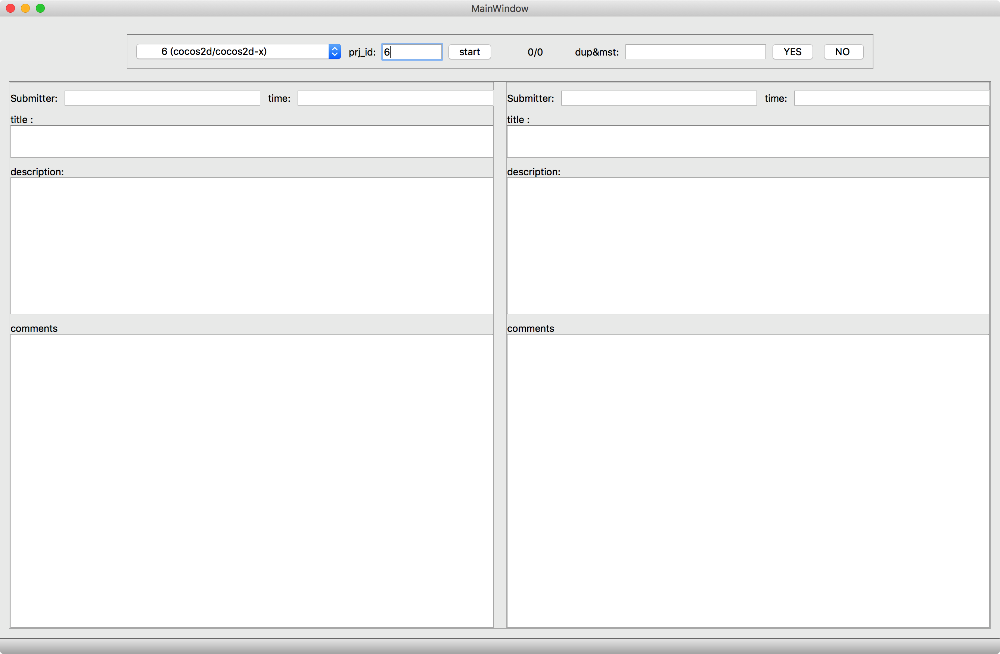
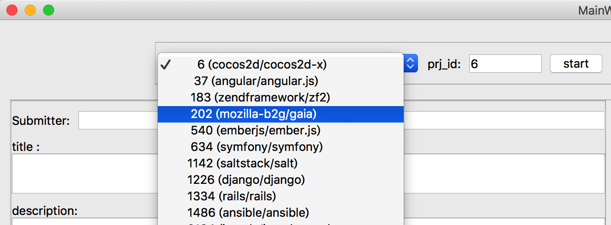
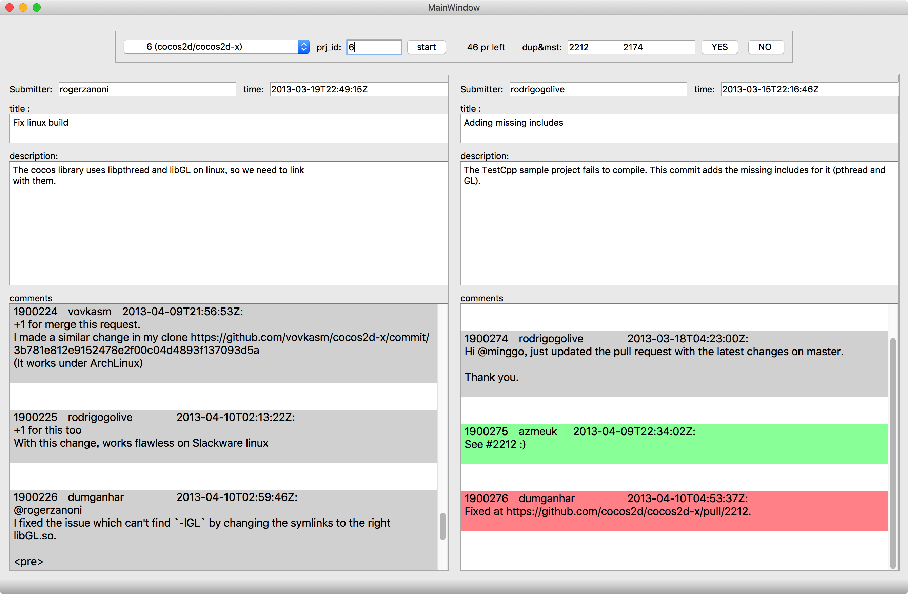

# Introduction
This documentation illustrates the details to recreate the dataset ``DupPR``.

``DupPR`` contains four parts of data: ``project``, ``pull-request``, ``comment``, and ``duplicate``. Actually, ``duplicate`` is the most valuable data which requires quite amount of time and effort to recreate, while the other three parts of data can be easily recreated from GitHub via a web spider. Therefore we don't occupy space to introduce how to recreate the three parts of data but make them immediately available in sql scripts which can be found in ``dataset/raw.zip``.  ``project.sql``, ``pull-request.sql``, ``comment.sql`` are used to import ``project``, ``pull-request``, and ``comment`` respectively. ``duplicate.sql``  is used to create an **empty** table which is expected to store the recreated ``duplicate``. In this documentation, we focus on illustrating the details to recreate ``duplicate``.

***Note***: we also provide ``dataset/duplicate.sql`` to make it possible to **directly use the complete ``duplicate``** that have been created by us, in case you want to directly conduct research or experiments based on the dataset. Therefore, please be careful with the two scripts ``dataset/raw/duplicate.sql`` and ``dataset/duplicate.sql`` and don't use the wrong file. 

# Content

- ``code`` contains the source code that are used to recreate  ``duplicate``.

- ``dataset/duplicate.sql`` is used to directly import the complete set of ``duplicate`` already created by us. 

- ``dataset/raw.zip`` contains the script files used to import the raw data that are necessary to recreate ``duplicate`` .

- ``README.md`` acts as the documentation of the dataset.

- ``imgs`` stores images that ``README.md`` needs

# Guidelines to recreate  ``duplicate``
To reproduce the dataset ``DupPR``, three main operations need to be re-executed: ``Import the existing dataset``, ``automatic identification``, and ``manual verifying``. 

> However, before taking action, you should download or ``git clone`` this repository to your local computer. 

###  Import the existing data
It is better to create a new database to specifically store ``DupPR`` and import the existing data to this database. 

> Step 1. Create a new database.

> Step 2. Import each  sql script into the created database.

After done importing, there are four tables in the database: ``project``, ``pull-request``, ``comment``, and ``duplicate``. The first three tables already contain data and ``duplicate`` is an empty table. In the following, we will try to add data to this empty table.

###  Automatic identification
And then, you can execute the following steps to conduct automatic identification on the existing data. 

> Step 1.  Configure the database connection.

In last stage, you create a database and store the exiting data. Therefore, you should specify the parameters that are needed for the code to access the database. Open python script file ``db_cfg.py`` and update the four variables ``host``, ``user``, ``passwd``, and ``db`` according to your actual settings.

> Step 2. Run python script  ``auto_ident.py``

After confirming that the  database is accessible with the four updated variables, you can now run the script ``auto_ident.py`` to automatically identify duplicate pull-requests based on the existing data. 

Now, a new folder is generated in the root directory of the repository, which contains several TXT files named by projects' ids. Each TXT file stores the identified candidate duplicates of the corresponding project. 

###  Manual Verifying
We developed a UI-based tool to support manual verifying. To conduct manual verifying, you should execute the following steps.

> Step 1. Launch the UI-based tool.

To launch it, you should run the script ``manual_verify.py``. 
the following is the initial view of the tool. 

{:height="80%" width="80%"}

> Step 2. Select a project and start verifying.

To start the verifying process, 
you should first select a project in the combox, whose candidate duplicate pull-requests you want to manually verify. 

{:height="80%" width="80%"}

After you click the ``start`` button a pair of duplicate pull-request together with their comments will be show and other duplicates would be show in order when you click buttons ``YES`` or ``NO``.

{:height="80%" width="80%"}

> Step 3. Click ``YES`` or ``NO``.

 To verify the duplicate relation between two pull-requests, you should review their titles, descriptions and comments. If you are sure that a pair of candidate pull-requests are really duplicate, you click the button ``YES``, otherwise you should click the button ``NO``. The confirmed duplicate pull-requests will be stored into the database. Moreover, no matter which button you click, the next pair of candidate duplicates will be fetched and show in the UI of the tool. 

